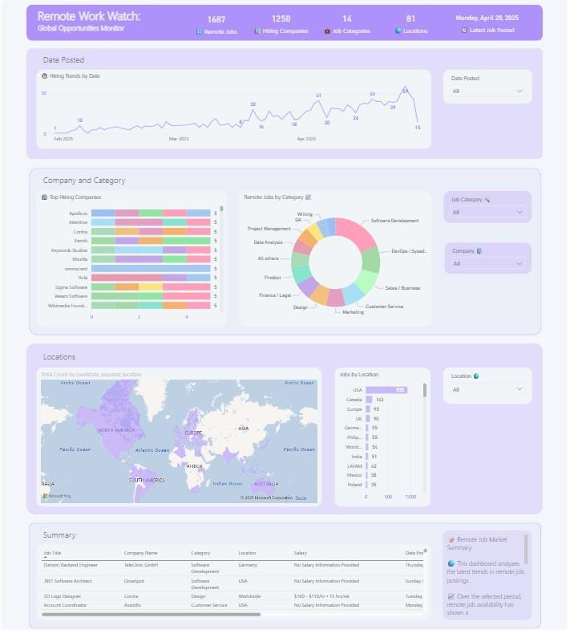
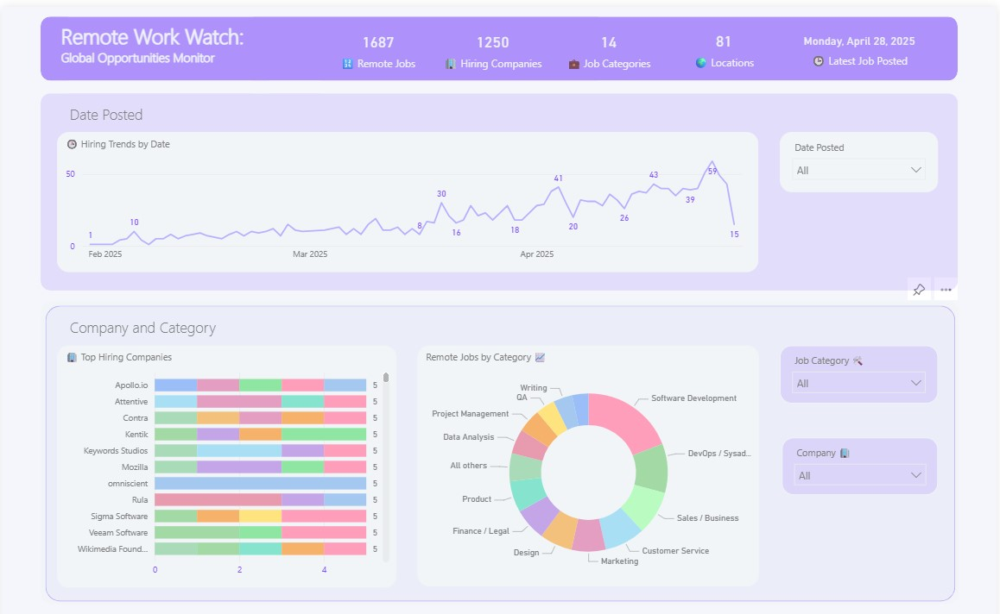
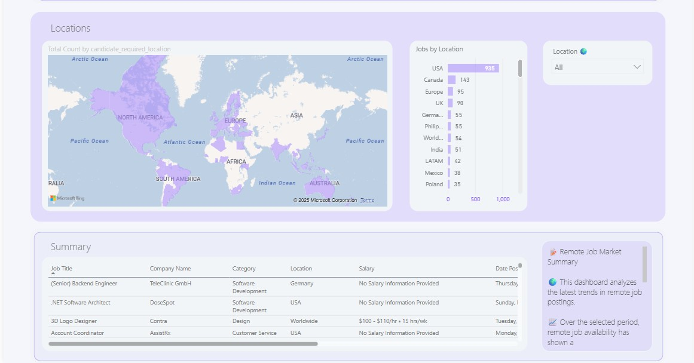

# 🌍 Remote Job Market Insights Dashboard

**Built with Power BI | Data Source: Remotive API**

---

## 📌 Project Overview

This interactive dashboard provides a high-level analysis of the global **remote job market**, built using live job listing data from the **Remotive API**. It enables users to explore remote hiring trends by company, category, location, and date — delivering actionable insights for job seekers, recruiters, and workforce strategists.

## 📸 Screenshots

---

## 🎯 Key Objectives

- Identify **which companies** are hiring remotely
- Explore **job categories and roles** in highest demand
- Visualize **geographic spread** of remote job opportunities
- Analyze **industry trends** over time using hiring data
- Demonstrate **real-time data integration** and dashboard storytelling

---

## 🔧 Tools & Technologies Used

- **Power BI Desktop**
- **Power Query** (ETL for API connection and data transformation)
- **DAX** for calculated metrics and KPIs
- **Remotive API** for fetching real-time remote job data
- **Custom visuals**: Filled maps, cards, slicers, bar and donut charts

---

## 📊 Dashboard Layout

### 🔹 Top Row — KPI Cards

| Metric | Description |
|--------|-------------|
| 🧮 **Total Remote Jobs** | Total jobs retrieved from the API |
| 🏢 **Unique Companies Hiring** | Number of distinct companies hiring remotely |
| 🗂️ **Job Categories** | Number of unique job categories |
| 🌍 **Locations Covered** | Count of unique candidate-required locations |

---

### 🔸 Second Row — 📅 Hiring Trends by Date

- *Line Chart*
  - Displays the number of remote jobs posted over time
  - Helps identify hiring spikes and dips

---

### 🗺️ Third Row - Charts

- **Top Companies Hiring Remotely** (Bar Chart)
  - X-axis: Company name  
  - Y-axis: Number of jobs  

- **Job Distribution by Category** (Donut Chart)
  - Visualizes the share of remote jobs across different industries

---

###  Fourth Row — Location Visual

- *Filled Map and Table*  
  - Jobs grouped by `candidate_required_location`  
  - Handles multiple-location roles by expanding entries

---

### 📋 Fifth Row — Job Listings Table

- Displays detailed job postings with columns for:
  - Title, Company, Category, Location, Date Posted, and URL  
  - Searchable and filterable

---

### 🎛️ Slicers

- Dynamic filters by:
  - **Job Category**
  - **Company**
  - **Location**
  - **Job Type**

---

### 🧠 Summary Panel

A text-based panel that highlights:
- Top hiring companies
- Fast-growing categories
- Unexpected hiring patterns or job types

---

## 💡 Impact & Use Cases

- **Job Seekers**: Find companies and roles hiring now
- **Recruiters**: Benchmark competitors’ hiring activity
- **HR/Workforce Planners**: Understand talent demand
- **Hiring Analysts**: Monitor growth in remote work sectors

---

## 📁 Project Details

- ✅ **Status**: Completed  
- ⏱️ **Time Taken**: ~24 hours  
- 📂 **GitHub**: https://github.com/Mzu-Soci/remote-job-insights-dashboard.git  
- 🔗 **Live LinkedIn Post**: [Add your post link here]  

---

## 🙌 Author

**Mzukisi Soci**  
Power BI Enthusiast | Data Storyteller | Remote Work Analyst  
📧 mzu.soci@holiwota.co.za | 🔗 https://www.linkedin.com/in/mzukisi-soci/

---

## 🔗 Acknowledgments

- [Remotive.io](https://remotive.io) — Remote job API provider  
- Freepik Community for visual inspiration

---

